<p align="center">
  
</p>

<p align="center">
  <a href="https://pypi.org/project/systemap/"></a>
  <a href="LICENSE"></a>
  
  
</p>

systemap gives a coding agent the tools to draw a map of your system and the
checker that refuses to let that map be incomplete or stale. You install it,
run `systemap init`, and tell your agent to map the repository. The agent
reads the facts out of the code, writes down what the parts are and what
they are to each other, checks it, and then makes a second pass over every
import the code has and the map does not, until a full pass changes
nothing. The result is one interactive page: readings you switch between,
components you click to see what they reach, journeys you step through one
edge at a time. You commit the page beside the code, and a CI check fails
any pull request that leaves it behind the tree.

The page fetches nothing, depends on nothing, and is generated by one
program, so a figure in a design document and the map it cites cannot
disagree.

## Why an agent, and not a script or a person

A map of a system needs two kinds of knowledge. The first is mechanical:
which modules exist, what each exports, which tests import it, where a run
starts. A script reads that out of the syntax tree in a second and never
gets it wrong. The second is judgement: which modules together form a thing
a reader would point at and name, what the edge between two parts means,
which question a reading answers. No script has that, and a person who has
it rarely has the patience to keep the map true through every refactor.

A coding agent has both, when two things are true. It follows a written
procedure, so its judgement is applied the same way every time. And a
checker refuses its output when a module is mapped by nobody, when a route
crosses a card it does not connect, or when the rendered page is older than
the model. systemap is that procedure and that checker. The agent does the
work; you read the short list of judgement calls it hands back, each with
its answer.

The two failure modes it is built against: a script's map is complete and
meaningless, because a module is not a part; a hand-drawn map is meaningful
and drifts, because nothing announces that a part moved.

## Quick start

    uv tool install systemap        # or: uv add --dev systemap
    systemap init                   # --no-ci to skip the workflow

Until the first PyPI release, install from the repository instead:
`uv tool install git+https://github.com/0xfauzi/systemap`.

`init` writes `systemap.toml`, a starter `map/model.py`, the agent's skill
under `.claude/skills/systemap/` (a `SKILL.md` and a `references/`
directory), and a workflow that runs the check on every push and pull
request. It never overwrites a file that exists, and it ends by printing
the sentence to give your agent:

> Map this repository with systemap. Follow the systemap skill.

The agent then runs `systemap extract`, writes the model, runs
`systemap check` until every module is mapped and the layout passes, runs
`systemap judgement` and acts on every line, renders with
`systemap refresh`, and goes round again until a full second pass changes
nothing. It hands you back every judgement line with its answer: groupings
that could go another way, edges it inferred rather than read, entry points
it left without a journey and why. You correct what you disagree with,
commit `docs/map/`, and turn on GitHub Pages from the `docs/` directory.

Any agent that can read a skill directory and run a command works the same
way. The skill is plain text; there is nothing vendor-specific in it.

### Install as a Claude Code plugin

The repository is also a plugin and its own marketplace, so the skill can
be installed without `init`:

    /plugin marketplace add 0xfauzi/systemap
    /plugin install systemap@systemap

For any other agent, copy [`skills/systemap/`](skills/systemap/) into the
agent's skills directory, or run `systemap skill` in the repository you are
mapping. The skill is in the Agent Skills format (front matter with a name
and a description, then the procedure, then references read on demand), so
one directory serves every agent.

## What the reader gets

<p align="center">
  
</p>

That is systemap's map of itself, drawn by the same command you will run,
from [`map/model.py`](map/model.py). The page is served from `docs/` by
GitHub Pages at <https://0xfauzi.github.io/systemap/map/>.

- **Readings.** One map, several layers, each answering one question. Four
  are derived from the model with no authoring, and the page opens on the
  first:
  - *Structure*: every component inside its region and container, no
    edges. What are the parts, and where does each sit?
  - *System context*: the actors outside the package and every edge that
    crosses the boundary; internal edges dimmed. Who and what is outside,
    and how does it reach in?
  - *Data flow*: every flow of the standard kind `data`, where an artifact
    moves. What moves, and where does it go?
  - *Control flow*: every flow of the standard kind `control`, where one
    part invokes, schedules or drives another. Who drives whom?

  A model with agents in it gains *Agents*, *Context* and *Tools* (below),
  and a model's own kinds get readings of their own after those.
- **Click.** Click a component and every neighbour on the current reading
  lights, each spoke carrying a verb in the direction of the edge. One
  sentence per neighbour says what the clicked part is to it. Prose is for
  emphasis; the edges carry the relationships.
- **Journeys.** Walks through the map, one edge at a time, one per entry
  point that matters: the first map of a repository; the second pass; a
  refactor that moves a module and fails the check until the map is
  refreshed.
- **Invariants.** The rules the repository states about itself, each citing
  its source, each pointing at the components it governs.
- **What exists today.** Every card is code in the tree: a component names
  the modules that are it and one entry they define, and the check refuses
  a name the code does not have. Nothing on the map is a plan.
- **Pan and zoom.** The map is as large as the system; the page is not
  squeezed to fit a screen.

### Agentic systems

When a part of the mapped system runs a model and acts on its output, the
model gives it `kind="agent"`, its prompts, memory and retrieved knowledge
`kind="context"`, and what it invokes `kind="tool"`. Two more standard flow
kinds apply: `context` (content entering an agent's window) and `tool` (an
agent invoking a tool). The page then shows three more readings: *Agents*
(every agent and every edge that touches one: which parts run a model, and
what do they reach?), *Context* (what enters each agent's window, and from
where?) and *Tools* (what can each agent do, and through what?). The cards
carry a mark, never a colour: an inner ring, a dotted border, a notched
corner. systemap's own map has an `Agent` actor and leaves it an actor,
since the agent that draws the map is outside the package; a repository
whose agents live inside the package maps them with the agent kind.

## How it refuses to lie

`systemap check` runs every rule below, prints each failure under its rule
with the fix, and exits 1 if any rule failed.

| rule | what it catches |
|---|---|
| coverage | a module in the facts that no component claims, or that two claim |
| entry | a component naming a module the facts do not have, no module, or an entry none of its modules defines |
| placement | a card outside its band, two cards overlapping, a flow of a kind neither standard nor declared, a context or tool flow whose agent end is not an agent, a flow or invariant naming something the model does not have |
| routes | a route through a card it does not connect, or across a band it neither starts nor ends in |
| labels | a label that touches a card, a route or another label |
| type size | any text below 11 px at native scale |
| meaning | a sentence, verb, override or journey step naming something the model does not have, a flow with no sentence, a custom layer taking a standard id |
| wheel | a relationship wheel whose labels leave the drawing or touch each other |
| stale | a facts file, page or figure older than the tree or the model |

Exit codes: `0` current, `1` a check failed, `2` the configuration or the
model cannot be used. A module that genuinely has no place on the map is
ignored under `[coverage]` in the configuration, and every ignore needs a
reason.

## The second pass

The check refuses contradictions; it cannot refuse omissions. `systemap
judgement` finds those mechanically, so what was missed is found rather
than remembered. It prints one line per thing to look at, and the agent
either changes the model or writes down why not:

| line | what it asks |
|---|---|
| single module | a component that claims one module: a real part, or an over-split? |
| possible mis-fold | a module whose name shares no word with its component: folded into the wrong part? |
| no sentence | a flow with no relation sentence |
| thin layer | a reading that lights fewer than two components, including a standard kind never used |
| entry point X has no journey | an entry point in the facts (a console script, a subcommand, a main, a public function of the package root) that no journey names |
| crossing import | module A of component P imports module B of component Q and no flow joins P and Q, in either direction: an edge the code has and the map does not |
| ignored | every module the coverage rule leaves unmapped, with its reason |

A report, not a gate: it always exits 0. The maintainer reads the answers.

## The model in one screen

The agent writes one Python module. Everything in it is a frozen dataclass.
This is an excerpt of systemap's own model, two cards and one edge; the
standard kinds need no declaring and the page derives the standard
readings:

```python
from systemap import Component, Flow, Meaning, Model, Region

MODEL = Model(
    canvas=(900, 420),
    containers=(),
    regions=(Region("gather", "GATHER", (24, 40, 400, 340)),
             Region("draw", "DRAW", (460, 40, 416, 340))),
    components=(
        Component(id="FactsExtractor", region="gather",
                  does="Walks the package's syntax tree and writes the facts.",
                  implemented_by=("systemap.extract",), entry="build", x=60, y=120),
        Component(id="Schematic", region="draw",
                  does="Draws the cards, the routes and the interaction script.",
                  implemented_by=("systemap.schematic", "systemap.theme"), entry="render",
                  x=520, y=120),
    ),
    flows=(Flow("FactsExtractor", "Schematic", "map.json", "data"),),
    flow_kinds=(),
)

MEANING = Meaning(
    plain={"FactsExtractor": "what reads the code", "Schematic": "what draws the map"},
    relations={("FactsExtractor", "Schematic"):
               "The facts say which modules each card stands for, for the line the panel prints."},
)
```

The full schema, with one worked example of every part, is in the skill
the agent reads: [`SKILL.md`](src/systemap/skill/SKILL.md) and its
[`references/`](src/systemap/skill/references/).

## Commands

| command | what it does |
|---|---|
| `systemap init [--no-ci]` | write the config, a starter model, the skill directory, and a workflow; never overwrites; prints the sentence for the agent |
| `systemap extract [--check]` | read the facts out of the tree into `docs/map/map.json`, entry points included; `--check` exits 1 when they no longer match the tree |
| `systemap check` | every rule in the table above; exit 1 with each fix named |
| `systemap render [--check] [--base REF]` | the page; `--check` exits 1 when it is stale; `--base` adds a change map against a ref |
| `systemap figure --out FILE` | one figure from the same generator: the system, a plan's reach (`--components A,B`), or a change (`--base REF`); `--layer ID` draws one reading only (that layer's edges, every card, the legend reduced to it); a `.svg` name writes the bare drawing |
| `systemap refresh` | extract, check, render, and every configured figure; "already current" when there is nothing to do |
| `systemap judgement` | the second-pass list: thin components, odd folds, edges without a sentence, thin layers, entry points without a journey, crossing imports without a flow, every ignore; always exit 0 |
| `systemap skill [--dir PATH] [--print]` | reinstall the skill directory, or print `SKILL.md` |

`--root DIR` names the project when it is not the current directory.

## Configuration

`systemap.toml` at the repository root, or a `[tool.systemap]` table in
`pyproject.toml`. Every key is optional; unknown keys are refused.

| key | default | meaning |
|---|---|---|
| `name` | the directory name | the page title |
| `[package_roots]` | every top-level package, or `src/<pkg>` | `"path" = "import name"` |
| `tests_dir` | `tests` | tests that import a module count as its guards |
| `model` | `map/model.py` | the module exporting `MODEL` and `MEANING` |
| `out_dir` | `docs/map` | where the facts, the page and the figures go |
| `facts_file` | `map.json` | the facts file's name inside `out_dir` |
| `spec_path` | none | a document whose `##` headings are recorded as spec sections |
| `planes` | none | second-level package names recorded as their own plane in the facts |
| `outside_label` | `OUTSIDE THE SYSTEM` | the index heading for actors outside every region |
| `[coverage]` | none | `ignore = [{module = "pkg.mod", reason = "..."}]`; an ignore needs a reason |
| `[theme]` | graphite, dark | colour tokens; `scheme = "light"` picks the paper scheme; `[theme.layers]` names a colour per layer id, standard ids included; `[theme.marks]` picks the mark per agent kind |
| `[[figures]]` | none | figures `refresh` regenerates: `out`, `mode` (`system` or `reach`), `components`, `caption`, `interactive`, `layer` (one reading's id: only that layer's edges); an `out` ending in `.svg` is the bare drawing |

## Principles

- No counts of code or tests anywhere on the page. The map explains what
  the system does, not how much of it there is.
- A component is something a reader would point at and name. A module is
  not a part.
- Edges carry the relationships. Prose is for emphasis.
- The map draws what exists today. Every module a component names is in
  the facts, and nothing on the map is a plan.
- Positions are placed by hand and the checker decides. The same system
  always draws the same picture, so a change in the picture is a change in
  the system.
- The agent authors, the checker refuses, the person reviews. Each of the
  three does the thing it is good at.
- The map is built in passes; the second pass is the point. The first
  draft is wrong in ways the checker cannot see, and the judgement finds
  them mechanically.

## What it does not do

It is not a call graph: the facts record imports and public surfaces, but
the map draws the flows the agent declared, not every call; the crossing
imports it did not draw are answered, not hidden. It is not a dependency
visualiser: modules are not cards, components are. It is not a UML tool:
there is one diagram, one hand-placed layout, and no notation beyond card,
line, label and a mark per kind.

## Development

    uv sync
    uv run pytest -q
    uv run mypy src --strict
    uv run ruff check .
    uv run systemap check      # the repository's own map must stay current

The skill has one source of truth: [`src/systemap/skill/`](src/systemap/skill/),
the directory the package ships and `systemap init` installs. The plugin's
copy at `skills/systemap/` is kept identical by a test that compares the
two trees; after editing the source, run
`rm -rf skills/systemap && cp -R src/systemap/skill skills/systemap`.
The plugin manifest's version is tested against the package version, so
the two are bumped together.

## Licence

MIT.
