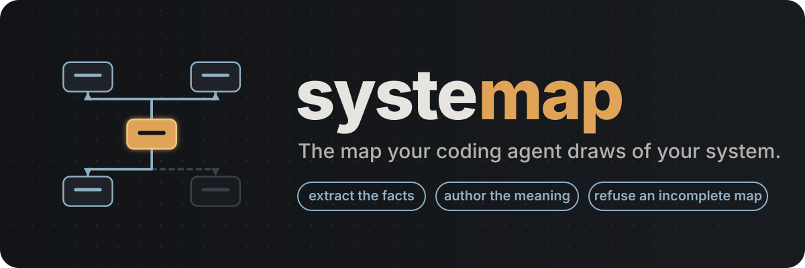

<p align="center">
  <picture>
    <source media="(prefers-color-scheme: dark)" srcset="assets/hero.svg">
    <source media="(prefers-color-scheme: light)" srcset="assets/hero-light.svg">
    
  </picture>
</p>

<p align="center">
  <a href="https://pypi.org/project/systemap/"></a>
  <a href="LICENSE"></a>
  
  
</p>

systemap gives a coding agent the tools to draw a map of your system and the
checker that refuses to let that map be incomplete or stale. You install it,
run `systemap init`, and tell your agent to map the repository. The agent
reads the facts out of the code, writes down what the parts are and what
they are to each other, checks it, and then makes a second pass over every
import the code has and the map does not, until a full pass changes
nothing. The result is one interactive page: readings you switch between,
components you click to see what they reach, journeys you step through one
edge at a time. You commit the page beside the code, and a CI check fails
any pull request that leaves it behind the tree.

The page fetches nothing, depends on nothing, and is generated by one
program, so a figure in a design document and the map it cites cannot
disagree.

## Why an agent, and not a script or a person

A map of a system needs two kinds of knowledge. The first is mechanical:
which modules exist, what each exports, which tests import it, where a run
starts. A script reads that out of the syntax tree in a second and never
gets it wrong. The second is judgement: which modules together form a thing
a reader would point at and name, what the edge between two parts means,
which question a reading answers. No script has that, and a person who has
it rarely has the patience to keep the map true through every refactor.

A coding agent has both, when two things are true. It follows a written
procedure, so its judgement is applied the same way every time. And a
checker refuses its output when a module is mapped by nobody, when a route
crosses a card it does not connect, or when the rendered page is older than
the model. systemap is that procedure and that checker. The agent does the
work; you read the short list of judgement calls it hands back, each with
its answer.

The two failure modes it is built against: a script's map is complete and
meaningless, because a module is not a part; a hand-drawn map is meaningful
and drifts, because nothing announces that a part moved.

## Quick start

    uv tool install systemap        # or: uv add --dev systemap
    systemap init                   # --no-ci to skip the workflow

Until the first PyPI release, install from the repository instead:
`uv tool install git+https://github.com/0xfauzi/systemap`.

`init` writes `systemap.toml` (with two figures configured, the Structure
reading and the whole map, both as `.svg`), a starter `map/model.py` with
no components yet and four regions laid out as a grid with the corridors
the edges need, the agent's skill under `.claude/skills/systemap/` (a
`SKILL.md` and a `references/` directory), and a workflow that runs the
check and the judgement on every push and pull request. It never
overwrites a file that exists, and it ends by printing the sentence to
give your agent:

> Map this repository with systemap. Follow the systemap skill.

The agent then runs `systemap extract`, writes the model with no
positions, runs `systemap place` (which lays the regions out with the
corridors the edges need and puts every card on the grid), runs
`systemap check` until every module is mapped and the layout passes, runs
`systemap judgement` and acts on every line, renders with
`systemap refresh` and reads the picture back with `systemap describe`,
and goes round again until a full second pass changes nothing. Every
judgement line it does not act on it answers in `[judgement] answered` in
`systemap.toml`, with a reason, singly or a family at a time, so the
answers live in the repository: groupings that could go another way,
edges the facts do not back, entry points it left without a journey and
why. You read the answers, correct what you disagree with, commit
`docs/map/`, and turn on GitHub Pages from the `docs/` directory.

The workflow `init` writes runs systemap from the released package,
pinned to the tag of the version that wrote it (`uvx --from
"git+https://github.com/0xfauzi/systemap@v0.8.0"`), so your project
takes no dependency on it. The pin moves to PyPI at 1.0. The workflow
pins every action to a commit, reads the tree and nothing else, and keeps
no token, so a workflow linter passes it as written.

Any agent that can read a skill directory and run a command works the same
way. The skill is plain text; there is nothing vendor-specific in it.

### Install as a Claude Code plugin

The repository is also a plugin and its own marketplace, so the skill can
be installed without `init`:

    /plugin marketplace add 0xfauzi/systemap
    /plugin install systemap@systemap

For any other agent, copy [`skills/systemap/`](skills/systemap/) into the
agent's skills directory, or run `systemap skill` in the repository you are
mapping. The skill is in the Agent Skills format (front matter with a name
and a description, then the procedure, then references read on demand), so
one directory serves every agent.

## What the reader gets

<p align="center">
  
</p>

That is systemap's map of itself, drawn by the same command you will run,
from [`map/model.py`](map/model.py): the Structure reading, every part in
its place and not one arrow. Each further reading adds the edges that
answer one question; this one is Control flow, who drives whom, and the
live page has them all.

<p align="center">
  
</p>

The page is served from `docs/` by GitHub Pages at
<https://0xfauzi.github.io/systemap/map/>.

- **Readings.** One map, several layers, each answering one question. Four
  are derived from the model with no authoring, and the page opens on the
  first:
  - *Structure*: every component inside its region and container, no
    edges. What are the parts, and where does each sit?
  - *System context*: the actors outside the package and every edge that
    crosses the boundary; internal edges dimmed. Who and what is outside,
    and how does it reach in?
  - *Data flow*: every flow of the standard kind `data`, where an artifact
    moves. What moves, and where does it go?
  - *Control flow*: every flow of the standard kind `control`, where one
    part invokes, schedules or drives another. Who drives whom?

  A model with agents in it gains *Agents*, *Context* and *Tools* (below),
  and a model's own kinds get readings of their own after those.
- **Click.** Click a component and every neighbour on the current reading
  lights, each spoke carrying a verb in the direction of the edge. One
  sentence per neighbour says what the clicked part is to it. Prose is for
  emphasis; the edges carry the relationships. The panel also prints the
  card's `interface` as its signature, its `entry` with the module that
  defines it, and its `note`; a card with a note carries a dot in its top
  corner, on the map and in every figure.
- **Journeys.** Walks through the map, one edge at a time, one per entry
  point that matters: the first map of a repository; the second pass; a
  refactor that moves a module and fails the check until the map is
  refreshed.
- **Invariants.** The rules the repository states about itself, each citing
  its source, each pointing at the components it governs.
- **What exists today.** Every card is code in the tree: a component names
  the modules that are it (or a symbol inside another card's module) and
  one entry they define, and the check refuses a name the code does not
  have. Nothing on the map is a plan.
- **What backs each edge.** Every flow carries an evidence state read
  from the facts: `observed` when an import joins its two ends, `external`
  when an actor is at either end, `declared` when nothing in the facts
  does. A declared edge is dashed, and the panel says so.
- **Pan and zoom.** The map is as large as the system; the page is not
  squeezed to fit a screen.

### Agentic systems

When a part of the mapped system runs a model and acts on its output, the
model gives it `kind="agent"`, its prompts, memory and retrieved knowledge
`kind="context"`, and what it invokes `kind="tool"`. Two more standard flow
kinds apply: `context` (content entering an agent's window) and `tool` (an
agent invoking a tool). The page then shows three more readings: *Agents*
(every agent and every edge that touches one: which parts run a model, and
what do they reach?), *Context* (what enters each agent's window, and from
where?) and *Tools* (what can each agent do, and through what?). The cards
carry a mark, never a colour: an inner ring, a dotted border, a notched
corner. systemap's own map has an `Agent` actor and leaves it an actor,
since the agent that draws the map is outside the package; a repository
whose agents live inside the package maps them with the agent kind.

A part that calls a model once and is not an agent by the repository's
own rule is marked `calls_model=True` instead: a context flow may end at
it and a tool flow start from it, the Context and Tools readings light
those flows, the panel says `calls a model`, and the `model sdk`
judgement line for its modules is answered by the flag. The Agents
reading stays agents only. A `store` or a `context` card may leave
`entry` empty when it is a namespace (a constants table); the panel then
reads `entry: none (a namespace)`.

## How it refuses to lie

`systemap check` runs every rule below, prints each failure under its rule
with the fix, and exits 1 if any rule failed.

| rule | what it catches |
|---|---|
| coverage | a module in the facts that no component claims, or that two claim; an ignore that names nothing, or only empty package markers (an `__init__` with no public names and no imports, which the rule leaves out on its own) |
| entry | a component naming a module the facts do not have, no module, or an entry none of its modules defines (a store or a context card may leave `entry` empty); a symbol claim (`"pkg.mod:name"`) of a module the facts do not have, of a name the module does not define, or of a module nobody claims |
| interface | an `interface` line whose leading identifier (the token before `(`, `.`, `->` or whitespace; both parts of `Class.method`) is not a name the component's modules define, a re-export included; refused with the closest defined name |
| placement | a card outside its band, two cards overlapping, a flow of a kind neither standard nor declared, two flows on one ordered pair, a context or tool flow whose agent end is neither an agent nor `calls_model`, a flow or invariant naming something the model does not have, two invariants with one number |
| routes | a route through a card it does not connect, or across a band it neither starts nor ends in |
| labels | a label that touches a card, a header or another label (both labels named, and the fix that applies: the gutter is full, named by its neighbours and the region to open up, or the label is wider than its seat); a container or region header wider than its box, a `sub` that needs more than two lines, or a header touching a card; a card whose name or plain word does not fit its budget, stated in the refusal (nothing on the map is elided) |
| type size | any text below 11 px at native scale |
| meaning | a sentence, verb, override or journey step naming something the model does not have, a flow with no sentence, a custom layer taking a standard id |
| wheel | a relationship wheel whose labels touch each other or the centre |
| stale | a facts file, page or figure older than the tree or the model |

Exit codes: `0` current, `1` a check failed, `2` the configuration or the
model cannot be used. A module that genuinely has no place on the map is
ignored under `[coverage]` in the configuration, and every ignore needs a
reason.

The check verifies the cards against the code; it cannot verify that an
edge exists, so every edge says whether the code backs it. The state is
computed from the facts at render and at check time, never authored:

| evidence | when | how it shows |
|---|---|---|
| `observed` | a module of one end imports a module of the other, in either direction; or the flow's sentence or artifact names a mechanism the repository lists under `[flows] observed_by` (a subprocess, a queue, a file), and then the panel says `observed by: queue` | a solid line; the panel says `observed: an import joins them` |
| `external` | an actor is at either end: the edge is outside the code | a solid line; the panel says `external: outside the code` |
| `declared` | nothing in the facts joins the two | a dashed line on the page and in every figure; the panel says `declared: no import behind it`; `systemap judgement` prints a `declared flow` line until the agent finds the evidence, names the mechanism in the sentence, or removes the edge |

## The second pass

The check refuses contradictions; it cannot refuse omissions. `systemap
judgement` finds those mechanically, so what was missed is found rather
than remembered. It prints one line per thing to look at, and the agent
either changes the model or writes down why not:

| line | what it asks |
|---|---|
| single module | a component that claims one module: a real part, or an over-split? |
| possible mis-fold | a module whose dotted path shares no word with its component's id, `does`, plain word or `interface`, in a component of several modules, and whose package holds none of the others: folded into the wrong part? |
| no sentence | a flow with no relation sentence |
| thin layer | a reading that lights fewer than two components, including a standard kind never used |
| entry point X has no journey | an entry point in the facts (a console script, a subcommand, a main, a public function of the package root) that no journey names |
| crossing import | module A of component P imports module B of component Q and no flow joins P and Q, in either direction: an edge the code has and the map does not |
| declared flow | a flow no import backs, whose sentence and artifact name no mechanism from `[flows] observed_by`: an edge the map has and the code does not; find the evidence, name the mechanism, or remove it |
| model sdk | module X imports a model SDK or an agent framework (anthropic, openai, google.adk and the rest of a built-in list, extended or reduced by `[facts] model_sdks`) and its component is neither an agent nor marked `calls_model` |

A report, not a gate: it exits 0, or 1 with `--strict` while any line is
open, for CI. The list has memory: a line answered under `[judgement]
answered` in `systemap.toml` is suppressed and counted (`judgement: 3
items for the maintainer to confirm, 21 answered`), and an answer that
matches no line is reported as stale, so answers cannot rot. An answer
names the exact line (`item`, or `items` for several) or a family with
one reason: `crossing = ["A", "B", ...]` for every crossing import between
any two of the ids, `crossing_into = "A"` for every one into A,
`crossing_from = "A"` for every one out of it, `kind = "single module"`
(or `"declared flow"`, or any other kind) for every line of a kind,
`module_sdk = "google.adk"` for every model sdk line of an import. The answers are what the maintainer reads, and they
live beside the model. Before any of it, `systemap suggest` prints a
first grouping from the facts alone (one proposal per package with two
or more modules, and the imports between proposals) as a starting point
to argue with, never the answer; the skill's target is three to ten
modules per component, N/10 to N/3 cards for N modules.

## The model in one screen

The agent writes one Python module. Everything in it is a frozen dataclass.
This is an excerpt of systemap's own model, two cards and one edge; the
standard kinds need no declaring and the page derives the standard
readings:

```python
from systemap import Component, Flow, Meaning, Model, Region

MODEL = Model(
    canvas=(900, 420),
    containers=(),
    regions=(Region("gather", "GATHER", (24, 40, 400, 340)),
             Region("draw", "DRAW", (460, 40, 416, 340))),
    components=(
        Component(id="FactsExtractor", region="gather",
                  does="Walks the package's syntax tree and writes the facts.",
                  implemented_by=("systemap.extract",), entry="build"),
        Component(id="Schematic", region="draw",
                  does="Draws the cards, the routes and the interaction script.",
                  implemented_by=("systemap.schematic", "systemap.theme"), entry="render"),
    ),
    flows=(Flow("FactsExtractor", "Schematic", "map.json", "data"),),
    flow_kinds=(),
)

MEANING = Meaning(
    plain={"FactsExtractor": "what reads the code", "Schematic": "what draws the map"},
    relations={("FactsExtractor", "Schematic"):
               "The facts say which modules each card stands for, for the line the panel prints."},
)
```

The cards carry no `x` and `y`: `systemap place` writes them, and a card
given both is pinned where they say. The full schema, with one worked
example of every part, is in the skill
the agent reads: [`SKILL.md`](src/systemap/skill/SKILL.md) and its
[`references/`](src/systemap/skill/references/).

## Commands

| command | what it does |
|---|---|
| `systemap init [--no-ci]` | write the config, an empty starter model, the skill directory, and a workflow pinned to this version; never overwrites; prints the sentence for the agent |
| `systemap extract [--check]` | read the facts out of the tree into `docs/map/map.json`: every module's surface, public names (a package `__init__` lists what it re-exports), imports inside and outside the package, tests, entry points; `--check` exits 1 when they no longer match the tree |
| `systemap facts` | read the facts back one view at a time, so nobody opens the JSON: `--modules` (one line per module: name, public names, imports, tests), `--module NAME` (its record), `--entry-points`, `--external` (every third-party import and who imports it), `--imports NAME` (what it imports and what imports it) |
| `systemap place [--print]` | a first position for every card without one, written into the model in place (only the `x=` and `y=` values, the boxes and the canvas move): regions on a two-column grid with the corridors the router needs, cards on the grid inside, ordered by barycentre sweeps over the flows; a card with `x` and `y` is pinned and never moved; deterministic, stdlib only; `--print` prints instead |
| `systemap check` | every rule in the table above; exit 1 with each fix named |
| `systemap render [--check] [--base REF]` | the page; `--check` exits 1 when it is stale; `--base` adds a change map against a ref |
| `systemap figure --out FILE` | one figure from the same generator: the system, a plan's reach (`--components A,B`), or a change (`--base REF`); `--layer ID` draws one reading only (that layer's edges, every card, the legend reduced to it); a `.svg` name writes the bare drawing |
| `systemap refresh` | extract, check, render, and every configured figure, then check what it wrote; "already current: the page matches the model's rendered fields and the facts" when there is nothing to do; exit 1 when the check fails |
| `systemap suggest` | a first grouping to argue with, never the answer: one proposed card per package with two or more modules, its modules, and the crossing imports between proposals, from the facts alone |
| `systemap judgement [--strict]` | the second-pass list: thin components, odd folds, edges without a sentence, thin layers, entry points without a journey, crossing imports without a flow, flows no import backs, model SDK imports outside an agent; answered lines suppressed and counted; exit 0, or 1 with `--strict` while a line is open |
| `systemap describe` | what a look at the picture would tell an agent that cannot look: how many cards are pinned and how many `place` positioned for the look, cards per region, bends and length per edge worst first with the gutter each label sits in, seats used of seats available per gutter (each named by the cards on either side and its coordinates), edges observed, external and declared, cards and edges per reading |
| `systemap serve [--port 8765]` | serve the output directory over HTTP on the loopback address and print the URL; the page's script does not run from a `file://` address |
| `systemap skill [--dir PATH] [--print]` | reinstall the skill directory, or print `SKILL.md` |

`--root DIR`, before or after the command, names the project when it is
not the current directory.

## Configuration

`systemap.toml` at the repository root, or a `[tool.systemap]` table in
`pyproject.toml`. Every key is optional; unknown keys are refused.

| key | default | meaning |
|---|---|---|
| `name` | `[project] name`, then the git repository's directory, then the directory name | the page title |
| `[package_roots]` | every top-level package or `src/<pkg>`, in the root and in every `[tool.uv.workspace]` member | `"path" = "import name"` |
| `tests_dir` | every directory named `tests` or `test` | one directory or a list; tests that import a module count as its guards |
| `model` | `map/model.py` | the module exporting `MODEL` and `MEANING` |
| `out_dir` | `docs/map` | where the facts, the page and the figures go |
| `facts_file` | `map.json` | the facts file's name inside `out_dir` |
| `spec_path` | none | a document whose `##` headings are recorded as spec sections |
| `planes` | none | second-level package names recorded as their own plane in the facts |
| `outside_label` | `OUTSIDE THE SYSTEM` | the index heading for actors outside every region |
| `[coverage]` | none | `ignore = [{module = "pkg.mod", reason = "..."}]`, or `module = "pkg.sub.*"` for a subtree; an ignore needs a reason; an empty package marker needs none |
| `[facts]` | none | `model_sdks = [...]`: import names added to the built-in list the `model sdk` judgement line reads; a leading `-` removes a built-in name (`"-google.adk"`) |
| `[flows]` | none | `observed_by = ["subprocess", "queue", ...]`: the mechanisms other than an import that join the repository's parts; a flow whose sentence or artifact names one is observed by it rather than declared |
| `[judgement]` | none | `answered = [{item = "<a judgement line>", reason = "..."}]`, or `items = [...]`, `crossing = ["A", "B", ...]`, `crossing_into = "A"`, `crossing_from = "A"`, `kind = "single module"` or `module_sdk = "google.adk"` with one reason for a family of lines; an answer needs a reason, a stale one is reported |
| `[theme]` | graphite, dark | colour tokens; `scheme = "light"` picks the paper scheme; `[theme.layers]` names a colour per layer id, standard ids included; `[theme.marks]` picks the mark per agent kind |
| `[[figures]]` | none | figures `refresh` regenerates: `out`, `mode` (`system` or `reach`), `components`, `caption`, `interactive`, `layer` (one reading's id: only that layer's edges); an `out` ending in `.svg` is the bare drawing |

## Principles

- No counts of code or tests anywhere on the page. The map explains what
  the system does, not how much of it there is.
- A component is something a reader would point at and name. A module is
  not a part.
- Edges carry the relationships. Prose is for emphasis.
- The map draws what exists today. Every module a component names is in
  the facts, and nothing on the map is a plan.
- Positions are fixed in the model and the checker decides. `systemap
  place` writes a first position for every card without one and never
  moves a card that has one, so the same system always draws the same
  picture, and a change in the picture is a change in the system.
- The agent authors, the checker refuses, the person reviews. Each of the
  three does the thing it is good at.
- The map is built in passes; the second pass is the point. The first
  draft is wrong in ways the checker cannot see, and the judgement finds
  them mechanically.

## What it does not do

It is not a call graph: the facts record imports and public surfaces, but
the map draws the flows the agent declared, not every call; the crossing
imports it did not draw are answered, not hidden, and every flow it did
draw says whether an import backs it. It is not a dependency
visualiser: modules are not cards, components are. It is not a UML tool:
there is one diagram, one fixed layout, and no notation beyond card,
line, label and a mark per kind.

## Development

Releases: tag `v<version>` on the release commit, then run `scripts/publish.sh`, which builds `dist/` and uploads with the PyPI token held in the maintainer's macOS Keychain (`--dry-run` builds and stops).

    uv sync
    uv run pytest -q
    uv run mypy src --strict
    uv run ruff check .
    uv run ruff format --check src tests map
    uv run systemap check      # the repository's own map must stay current
    uv run systemap judgement --strict
    uv run systemap place --print
    uv run systemap describe
    uv run systemap facts --modules
    uv run systemap suggest

The skill has one source of truth: [`src/systemap/skill/`](src/systemap/skill/),
the directory the package ships and `systemap init` installs. The plugin's
copy at `skills/systemap/` is kept identical by a test that compares the
two trees; after editing the source, run
`rm -rf skills/systemap && cp -R src/systemap/skill skills/systemap`.
The plugin manifest's version is tested against the package version, so
the two are bumped together.

## Where it is going

[ROADMAP.md](ROADMAP.md) names every gap between this release and 1.0, with a mechanism and an acceptance number for each.

## Licence

MIT.
